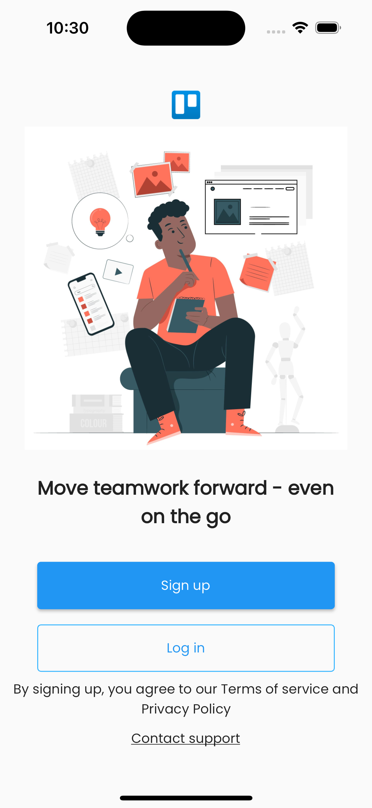

# Powersync + Flutter

## Introduction

Trello App Clone built with [Flutter](https://flutter.dev/) :star2: [Powersync](https://powersync.co/) and [Supabase](https://supabase.io/)



- `trelloappclone_powersync_client` is a library that defines the domain model and integrates with Powersync and Supabase
- `trelloappclone_flutter` contains the Trello clone Flutter app

## Getting Started

First checkout out [the getting started guide](https://docs.powersync.co/integration-guides/supabase-+-powersync) for [Powersync](https://powersync.co/) and [Supabase](https://supabase.io/).

TODO: describe below steps from basic tut.
- [ ] Create Powersync & Supabase accounts

## Configuring Supabase
TODO: describe below steps from basic tut.
- [ ] Setup Supabase project

### Creating Database Tables
After creating the Supabase project, we still need to create the tables in the database. 

TODO: use `tables.sql` and explain how to run this in Supabase SQL editor
 
- [ ] Create tables in Supabase (using generated sql files)
- [ ] set email confirmation flow to false

### Create the Postgres Publication

PowerSync uses the Postgres [Write Ahead Log (WAL)](https://www.postgresql.org/docs/current/wal-intro.html) to replicate data changes in order to keep PowerSync SDK clients up to date.

Run the below SQL statement in your Supabase SQL Editor:
```sql
create publication powersync for table activity, attachment, board, card, checklist, comment, listboard, member, trellouser, workspace;
```

## Configuring PowerSync

TODO: create below instructions from basic tut
- [ ] Setup Powersync project 
- [ ] and connect to Supabase

## Configuring Flutter App
TODO: describe below steps from basic tut.
- [ ] Configure Flutter app with powersync project settings (see basic Powersync Tut)

Note that at this stage _we have NOT yet setup any sync rules_. This means that the app will not yet retain any data that you create locally. What actually happens is that the data gets synced to Supabase (you can check with the Supabase SQL editor), but since there are no valid sync rules, Powersync deletes it from the local store, thus making it look like the workspaces and boards your created, are disappearing.

## Configuring Sync Rules
[Sync rules](https://docs.powersync.co/usage/sync-rules) are necessary so that PowerSync knows which data to sync to which client app instance.

### Global sync rules to get things working

We can be naive about it, and use a global bucket definition, that at least specify in some way which users can get data. 

- `trelloappclone_powersync_client.dart/sync-rules-0.yaml` provides such a naive approach. 
- Copy these sync rules to `sync-rules.yaml` under your Powersync project instance, and deploy the rules. 
- When you now run the app, it will actually show and retain data.
- The app code itself applies some basic filtering to only show data that belongs to the current user, or according to the visibility and membership settings of the various workspaces and boards.

### Using sync rules to enforce permissions
However, it is better that we do not sync data to the client that the logged-in user is not allowed to see. We can use Powersync sync rules to enforce permissions, so that users can only see and edit data that they are allowed to see and edit.

First, we need to understand the permissions from the app domain model:

- A **workspace** is created by a user — this user can always see and edit the workspace.
- A **workspace** has a specific *visibility*: private (only the owner can see it), workspace (only owner and members can see it), or public (anyone can see it).
- A **workspace** has a list of *members* (users) that can see and edit the workspace, if the workspace is not private.
- A **board** is created by a user — this user can always see and edit the board as long as the user can still access that workspace
- A **board** has a specific *visibility*: private (only the owner can see it), workspace (only owner and members belonging to the parent workspace can see it)
- A user can see (and edit) any of the **cards** and **lists** belonging to a **board** that they have access to.
- A user can see (and edit) any of the **checklists**, **comments**, and **attachments** belonging to a **card** that they have access to.

Also have a look at `trelloappclone_flutter/lib/utils/service.dart` for the access patterns used by the app code.

Let us explore how we can use sync rules to enforce these permissions and access patterns.

TODO steps:

1. add workspace-based bucket
1. add board-based bucket
1. ???


## Build & Run the App

- Run ``` flutter pub get ``` to install the necessary packages on your command line that's navigated to the root of the project.
- Invoke the ``` flutter run ``` command.
- TODO: must run on iOS or Android (no web app support yet)


### Importing / Generating Data

TODO

## App Architecture

TODO: explain how it sticks together

1. overview of layers (app, client lib)
2. end-to-end discussion of how an entity is created, updated, deleted
6. discussion on sync rules applied
3. discussion of watch query example
4. discussion of transaction example
5. discussion on IDs?

## Feedback

- Feel free to send feedback . Feature requests are always welcome. If there's anything you'd like to chat about, please don't hesitate to [reach out to us](https://docs.powersync.co/resources/contact-us).


## Acknowledgements

This tutorial is based on the [Serverpod + Flutter Tutorial](https://github.com/Mobterest/serverpod_flutter_tutorial) by [Mobterest](https://www.instagram.com/mobterest/

# TODOs

- [X] Basic Powersync and Supabase setup
- [X] Create Supabase tables
- [X] Port Serverpod client code to Powersync client code
- [X] Update App code to user powersync client code
- [X] Test if it works with local db (sqlite)
- [X] Update to use Supabase Auth
- [X] implement basic global sync rules
- [X] Test if global syncing works
- [ ] Tweak datamodel to allow per workspace lookups: add workspaceId reference to various entities (update on supabase, etc)
- [ ] Tweak sync rules to enforce permissions (according to workspace owner, visibility, and members)
- [ ] Test if permissions are enforced by Powersync
- [ ] Look at using watch queries (for when other users update data)
- [ ] Look at using transactions
- [ ] Data generation (or import) functionality for testing bigger datasets
- [ ] README/Tutorial writing & cleanup
- [ ] (nice2have) seems Comments are broken in the app - look at making this work properly
- [ ] (nice2have) get attachment uploads working with supabase
- [ ] (nice2have) implement email confirmation flow
- [ ] (nice2have) improve logging

## Bugs in app

Do we fix this or not?

- [ ] comments does not seem to work
- [ ] board details screen shows static data
- [ ] board share option cannot include "public" as an option

## Possible next steps

* Email confirmation flow
* Update of password or email
* Enhancing UX of app (there are many irritating issues and things not working yet in the original app)

## Changes from original Trello clone app

TODO: decide if we want to discuss this in the tutorial.

- Updated data model so that all `id` fields are Strings, and using UUIDs (it was auto-increment integer fields in the original app)
- Updated data model so that all entities refers to the `workspaceId` of workspace in which it was created (this facilitates the sync rules)